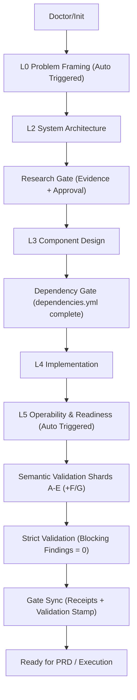

# Layered Architect

Agent-first architecture planning framework with deterministic gates, verifiable research evidence, and semantic cross-layer validation.

**Status:** Production-ready for agent workflows  
**Scope:** L0–L5 layered architecture + PRD alignment + adaptation of legacy docs

---

## Why this exists

Architecture work is often inconsistent, non-auditable, and too hard to review. This skill makes it structured, repeatable, and agent-friendly without bloating your workflow.

---

## Core Capabilities

- **Layered Architecture (L0–L5)** with strict validation
- **Structured Findings Engine** with source path/section/fix command
- **Receipt-backed Gates** (no manual gate mutation)
- **Research Evidence Gate** (`research.evidence.json`)
- **Tradeoff Matrix + Risk Register** baked into the process
- **PRD generation** aligned to finalized architecture
- **Universal adapter** to ingest existing docs
- **Audit-friendly logs** in JSONL

---

## Architecture Overview



---

## Repo Layout

- `SKILL.md` Agent instructions and flow
- `references/ARCHITECTURE_WORKFLOW.md` Canonical staged workflow
- `references/QUESTION_WORKFLOW.md` Canonical question strategy
- `assets/` Templates and examples
- `references/` Guides, validation, question sets, domain profiles
- `schemas/` JSON schemas for layers and mappings
- `scripts/` Tooling (includes `arch.py` unified CLI)

---

## Installation

### Codex CLI / IDE extensions

Place this folder in one of the supported skill locations and restart Codex:

- Repo-scoped: `$CWD/.codex/skills/layered-architect/`
- Repo-scoped (parent): `$CWD/../.codex/skills/layered-architect/`
- Repo root: `$REPO_ROOT/.codex/skills/layered-architect/`
- User-scoped: `$CODEX_HOME/skills/layered-architect/` (default `~/.codex/skills/`)
- Admin: `/etc/codex/skills/layered-architect/`

### Other tools (OpenCode, Claude Code, Gemini CLI, Cursor)

Place the `layered-architect` folder into your tool’s skill/plugins directory and restart.  
Check your tool’s docs for permission settings in plan modes.

---

## Quick Start (New Architecture)

Preferred (unified CLI):

```bash
python scripts/arch.py doctor
python scripts/arch.py init --path .
python scripts/arch.py validate --path .plan --strict --format json > .plan/last-validation.json
python scripts/arch.py gate sync --path .plan --from .plan/last-validation.json
```

Agent-friendly:
```bash
python scripts/arch.py doctor --json
```

Unified CLI only:
```bash
python scripts/arch.py init --path .
python scripts/arch.py validate --path .plan
python scripts/arch.py deps --path .plan
```

## Canonical Agent Docs

- `SKILL.md`
- `references/ARCHITECTURE_WORKFLOW.md`
- `references/QUESTION_WORKFLOW.md`

---

## Guided Start (Fresh vs Existing Docs)

```bash
python scripts/arch.py doctor
```

- If `.plan/` exists → continue with validation  
- If docs exist but no `.plan/` → use mapping adapter  
- If no docs → initialize from scratch

---

## Optional Layers (L0/L5)

L0/L5 are auto-triggered by workflow markers and shown in `arch.py status`.

Templates:
- `assets/template-l0-problem-framing.md`
- `assets/template-l5-operability-readiness.md`

---

## PRD Stage (Post-Architecture)

Generate a PRD aligned to the finalized architecture:

- `assets/template-prd.md`

---

## Universal Adapter (Existing Docs → L0–L5)

Preferred (unified CLI):
```bash
python scripts/arch.py map --suggest --apply
```

Unified mapping:
```bash
python scripts/arch.py map --suggest
```

Then edit `plan.map.yml`, and apply:
```bash
python scripts/arch.py map --apply
```

Optional citations:
```bash
python scripts/arch.py map --apply --cite
```

If `.plan/constraints.yml` is missing, the adapter generates a stub registry
from any `CON-###` references in mapped sources.

Unmapped files are reported for manual review.

---

## Import Existing Drafts

If you already drafted architecture content elsewhere:

```bash
python scripts/arch.py import --source /path/to/draft.md --target .plan
```

---

## Constraint Registry

If you already have L1 constraints in markdown, you can extract them into
`.plan/constraints.yml`:

```bash
python scripts/arch.py constraints extract --path .plan/L1-meta-architecture.md --out .plan/constraints.yml
```

Auto-sync during validation:
```bash
python scripts/arch.py validate --path .plan --auto-constraints
```

Auto-create dependency stub if missing:
```bash
python scripts/arch.py validate --path .plan --auto-deps
```

---

## Dependency Graph (Required)

Maintain `.plan/dependencies.yml` as the canonical dependency graph.
Set `status: complete` when finished. Validation is gated on this.

Validate:
```bash
python scripts/arch.py deps --path .plan
```

Schema:
`schemas/dependencies.schema.json`

---

## Validation & Diagnostics

Unified CLI:
```bash
python scripts/arch.py validate --path .plan --strict
```

Strict mode blocks on warnings and errors.
Validation returns structured findings with exact file/section and fix command.

Debug single layer (unified CLI):
```bash
python scripts/arch.py validate --layer L2 --path .plan
```

Soft mode (debug):
```bash
python scripts/arch.py validate --layer L2 --path .plan --soft
```

Soft mode (full validation):
```bash
python scripts/arch.py validate --path .plan --soft
```

Read-only mode (avoid logs):
```bash
LAYERED_ARCHITECT_READONLY=1 python scripts/arch.py validate --path .plan
```

Disable any auto-writes:
```bash
python scripts/arch.py validate --path .plan --auto-constraints --no-write
```

## Semantic Cross-Layer Validation (Required)

**Required gate.** After scripted validation, run sharded subagent checks:
`references/semantic-validation.md`

Required shards include:
- L1↔L2, L2↔L3, L3↔L4
- constraints.yml↔L2/L3/L4
- dependencies.yml↔L3/L4
- L0↔L1 if L0 exists
- L4↔L5 if L5 exists

Do not declare completion until:
- semantic shards are validated,
- semantic completion receipt is written via CLI.

```bash
python scripts/arch.py semantic validate --path .plan --strict
python scripts/arch.py semantic complete --path .plan --completed-by <name>
```

## Research Gate (Time-Sensitive Decisions)

If external dependencies are present, research is required before finalizing L2/L3.
Required artifacts:
- `.plan/research.md`
- `.plan/research.evidence.json`

Approve via CLI (explicit user approval required):
```bash
python scripts/arch.py research approve --path .plan --approved-by <name> --confirm-user-approval
```

## ADR Generation

Generate Architecture Decision Records from layer decision logs:

```bash
python scripts/arch.py adrs --path .plan
```

## Diagram Generation

Generate Mermaid/PlantUML diagrams from L2 data flow:

```bash
python scripts/arch.py diagrams --path .plan --format both
```

## Consistency Checks

Cross-layer semantic checks (constraints, interfaces, modules):

```bash
python scripts/arch.py consistency --path .plan
```

## Deterministic Next Step

```bash
python scripts/arch.py status --path .plan
python scripts/arch.py next --path .plan
```

---

## Logging

Scripts write JSONL logs to:
```
.plan/logs/*.jsonl
```

Each entry includes timestamp, run_id, script, event, and structured data.

---

## Requirements

- Python 3
- PyYAML:
```bash
pip install pyyaml
```

Preflight (optional):
```bash
python scripts/arch.py check-deps
```

Install with:
```bash
pip install -r requirements.txt
uv pip install -r requirements.txt
```

---

## OpenCode API Test (Real Server)

Scripted test flow against a running OpenCode server:

```bash
scripts/opencode_test.sh
```

Environment overrides:
```bash
OPENCODE_HOST=http://localhost:4096
OPENCODE_REPO=/path/to/repo
OPENCODE_AGENT=sisyphus
OPENCODE_TIMEOUT=60
```

What it does:
- Creates a session
- Prompts the agent to detect repo type and ask guided questions
- Auto-answers the question tool
- Requests strict validation (read-only)
- Prints responses

Requires `curl` and `jq`.

---

## Domain Profiles (Optional)

Use domain-specific prompts in:
- `references/domain-profiles.md`

---

## Contributing

Issues and PRs are welcome. Keep changes small, agent-friendly, and aligned to schemas.

---

## License

MIT License. See `LICENSE`.
