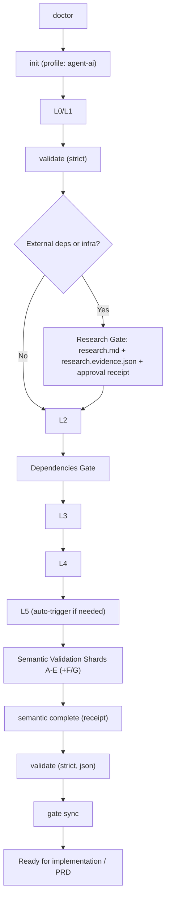

# Layered Architect

Deterministic architecture planning for humans and coding agents who occasionally think "`TODO: figure it out later`" is a design pattern.

## What This Is

`layered-architect` is a skill/framework for producing architecture docs that are:
- structured,
- traceable,
- validated,
- hard to fake with hand-wavy prose.

It enforces a staged flow (L0-L5), strict gates, research evidence, and semantic cross-layer checks.

## What Problem It Solves

Most architecture docs fail in one of these ways:
- no clear constraints,
- decisions not linked to requirements,
- great-looking diagrams that cannot survive implementation,
- "we validated it" with zero proof.

This repo fixes that with explicit gates and auditable artifacts.

## Architecture Flow



## Core Principles

- `Strict means strict`: warnings block progression.
- `No manual gate toggling`: gate state is receipt-backed.
- `Research must be evidenced`: no "trust me bro, model memory said so".
- `Cross-layer consistency matters`: L1 constraints must survive into L4/L5 reality.

## Repository Layout

- `SKILL.md` agent operating rules
- `references/ARCHITECTURE_WORKFLOW.md` canonical sequence and gates
- `references/QUESTION_WORKFLOW.md` canonical questioning and ambiguity handling
- `references/INDEX.md` reference map
- `scripts/arch.py` unified CLI (single entrypoint)
- `schemas/` gate, dependency, and evidence schemas
- `assets/` templates

## Quick Start

```bash
python scripts/arch.py doctor --path .
python scripts/arch.py init --path . --profile agent-ai
python scripts/arch.py status --path .plan
python scripts/arch.py next --path .plan
```

When ready to validate:

```bash
python scripts/arch.py validate --path .plan --strict --format json > .plan/last-validation.json
python scripts/arch.py gate sync --path .plan --from .plan/last-validation.json
```

## Unified CLI Cheatsheet

### Project lifecycle

```bash
python scripts/arch.py doctor --path .
python scripts/arch.py init --path . --profile agent-ai
python scripts/arch.py status --path .plan
python scripts/arch.py next --path .plan
python scripts/arch.py run --path .plan
```

### Validation

```bash
python scripts/arch.py validate --path .plan --strict
python scripts/arch.py validate --path .plan --soft
python scripts/arch.py validate --path .plan --strict --format json > .plan/last-validation.json
python scripts/arch.py deps --path .plan --strict
python scripts/arch.py lint --path . --strict
python scripts/arch.py consistency --path .plan
```

### Research gate

```bash
python scripts/arch.py research validate --path .plan --strict
python scripts/arch.py research approve --path .plan --approved-by "<name>" --confirm-user-approval
```

### Semantic gate

```bash
python scripts/arch.py semantic validate --path .plan --strict
python scripts/arch.py semantic complete --path .plan --completed-by "<name>"
```

### Gate sync

```bash
python scripts/arch.py gate sync --path .plan --from .plan/last-validation.json
```

## Required Artifacts

- `.plan/gates.yml`
- `.plan/constraints.yml`
- `.plan/dependencies.yml`
- `.plan/research.md` (when research required)
- `.plan/research.evidence.json` (when research required)
- `.plan/semantic-validation.md|json`

## Research Evidence (Anti-Hallucination)

When research is required, approvals only count if evidence exists and validates:
- sources with retrieval timestamps,
- claims mapped to source IDs,
- decision impact mapping,
- executor metadata (`task_id` or `manual_user_input` path).

If strict mode is enabled and evidence is missing/weak, progression is blocked.

## Semantic Validation (Shard-Based)

Required shards:
- A: L1 <-> L2
- B: L2 <-> L3
- C: L3 <-> L4
- D: constraints.yml <-> L2/L3/L4
- E: dependencies.yml <-> L3/L4
- F if L0 exists
- G if L5 exists

Each shard needs status, findings, executor metadata, and evidence refs.

## Agent Docs (Canonical)

- `SKILL.md`
- `references/ARCHITECTURE_WORKFLOW.md`
- `references/QUESTION_WORKFLOW.md`
- `references/INDEX.md`

Deprecated docs are kept as lightweight redirects for compatibility.

## Installing

Place this folder into your tool's skills/plugins location and restart:
- Codex skill directory, or
- your platform's equivalent skill folder.

Then invoke `/layered-architect` (or your platform's skill invocation syntax).

## Testing

Run the built-in test suite:

```bash
python scripts/tests/test_all.py
```

## Opinionated Notes

- This framework values determinism over vibes.
- If you want "just brainstorming", this is probably too strict.
- If you need architecture that survives real implementation and review, this is exactly the point.

## FAQ

### "Can I just set `research_approved: true` manually?"
No. That is equivalent to self-signing your own compliance audit.

### "Can I skip semantic validation?"
You can, in the same way you can deploy on Friday at 5:59 PM. Technically possible, generally unwise.

### "Why so many gates?"
Because postmortems are more expensive than validation.

## License

MIT. See `LICENSE`.
