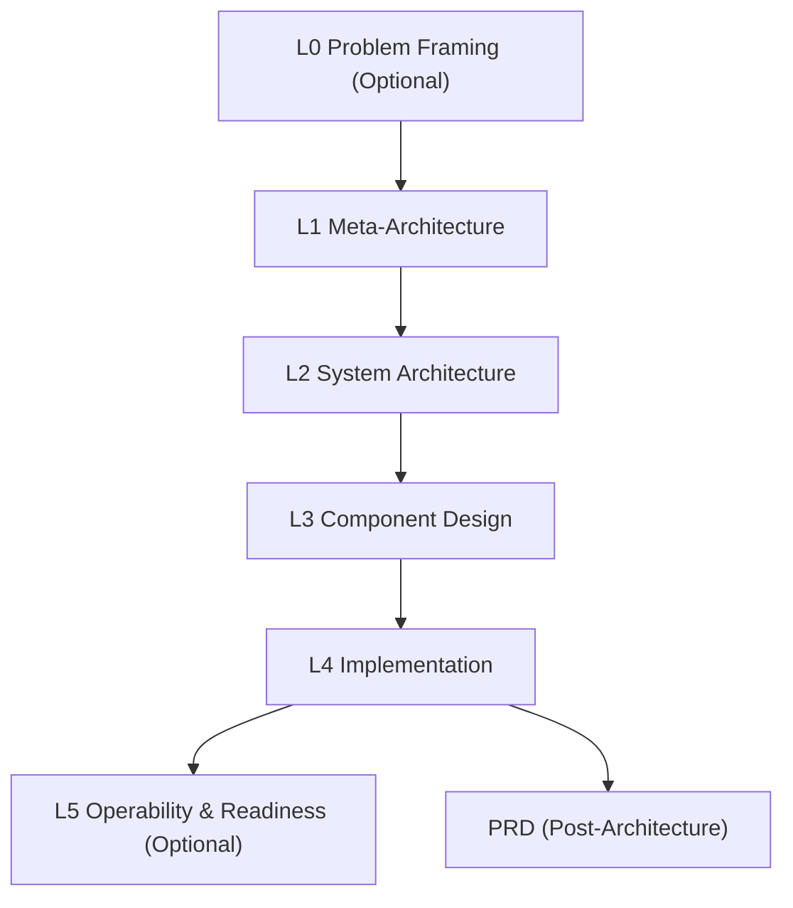

# Layered Architect

Agent-first architecture planning skill that produces professional, audit-friendly system designs. Built for modern agentic tools, with strict validation, decision logs, and traceable constraints.

**Status:** Production-ready for agent workflows  
**Scope:** L0–L5 layered architecture + PRD alignment + adaptation of legacy docs

---

## Why this exists

Architecture work is often inconsistent, non-auditable, and too hard to review. This skill makes it structured, repeatable, and agent-friendly without bloating your workflow.

---

## Core Capabilities

- **Layered Architecture (L0–L5)** with strict validation
- **Structured Decision Logs** for cross-validation
- **Tradeoff Matrix + Risk Register** baked into the process
- **PRD generation** aligned to finalized architecture
- **Universal adapter** to ingest existing docs
- **Audit-friendly logs** in JSONL

---

## Architecture Overview



---

## Repo Layout

- `SKILL.md` Agent instructions and flow
- `assets/` Templates and examples
- `references/` Guides, validation, question sets, domain profiles
- `schemas/` JSON schemas for layers and mappings
- `scripts/` Tooling (validation, linting, adapter)

---

## Installation

### Codex CLI / IDE extensions

Place this folder in one of the supported skill locations and restart Codex:

- Repo-scoped: `$CWD/.codex/skills/layered-architect/`
- Repo-scoped (parent): `$CWD/../.codex/skills/layered-architect/`
- Repo root: `$REPO_ROOT/.codex/skills/layered-architect/`
- User-scoped: `$CODEX_HOME/skills/layered-architect/` (default `~/.codex/skills/`)
- Admin: `/etc/codex/skills/layered-architect/`

### Other tools (OpenCode, Claude Code, Gemini CLI, Cursor)

Place the `layered-architect` folder into your tool’s skill/plugins directory and restart.  
Check your tool’s docs for permission settings in plan modes.

---

## Quick Start (New Architecture)

1. Initialize a plan:
```bash
python scripts/init_architecture.py my-project
```

2. Fill and validate layers:
```bash
python scripts/validate_layer.py L1
python scripts/validate_layer.py L2
python scripts/validate_layer.py L3
python scripts/validate_layer.py L4
```

3. Check constraints:
```bash
python scripts/check_constraints.py
```

---

## Guided Start (Fresh vs Existing Docs)

```bash
python scripts/start_arch.py
```

- If `.plan/` exists → continue with validation  
- If docs exist but no `.plan/` → use mapping adapter  
- If no docs → initialize from scratch

---

## Optional Layers (L0/L5)

Use only when triggers apply:

- **L0 Problem Framing:** unclear scope, conflicting goals  
- **L5 Operability & Readiness:** delivery readiness, compliance, cost controls

Templates:
- `assets/template-l0-problem-framing.md`
- `assets/template-l5-operability-readiness.md`

---

## PRD Stage (Post-Architecture)

Generate a PRD aligned to the finalized architecture:

- `assets/template-prd.md`

---

## Universal Adapter (Existing Docs → L0–L5)

1. Suggest mapping:
```bash
python scripts/map_architecture.py --suggest
```

2. Edit `plan.map.yml`

3. Generate summaries:
```bash
python scripts/map_architecture.py --apply
```

Optional citations:
```bash
python scripts/map_architecture.py --apply --cite
```

Unmapped files are reported for manual review.

---

## Validation & Linting

Strict by default:
```bash
python scripts/validate_layer.py L2
```

Validate all layers (path-aware):
```bash
python scripts/validate_layer.py --all --path .plan
```

Soft mode:
```bash
python scripts/validate_layer.py --soft L2
```

Path-only (defaults to all layers):
```bash
python scripts/validate_layer.py .plan
```

Lint and dependency checks:
```bash
python scripts/lint_architecture.py .
python scripts/dependency_graph.py --check --path .plan
```

---

## Logging

Scripts write JSONL logs to:
```
.plan/logs/*.jsonl
```

Each entry includes timestamp, run_id, script, event, and structured data.

---

## Requirements

- Python 3
- PyYAML:
```bash
pip install pyyaml
```

Preflight (optional):
```bash
python scripts/check_deps.py
```

Install with:
```bash
pip install -r requirements.txt
uv pip install -r requirements.txt
```

---

## OpenCode API Test (Real Server)

Scripted test flow against a running OpenCode server:

```bash
scripts/opencode_test.sh
```

Environment overrides:
```bash
OPENCODE_HOST=http://localhost:4096
OPENCODE_REPO=/path/to/repo
OPENCODE_AGENT=sisyphus
OPENCODE_TIMEOUT=60
```

What it does:
- Creates a session
- Prompts the agent to detect repo type and ask guided questions
- Auto-answers the question tool
- Requests strict validation (read-only)
- Prints responses

Requires `curl` and `jq`.

---

## Domain Profiles (Optional)

Use domain-specific prompts in:
- `references/domain-profiles.md`

---

## Contributing

Issues and PRs are welcome. Keep changes small, agent-friendly, and aligned to schemas.

---

## License

Add a `LICENSE` file before publishing if you want to allow reuse.
