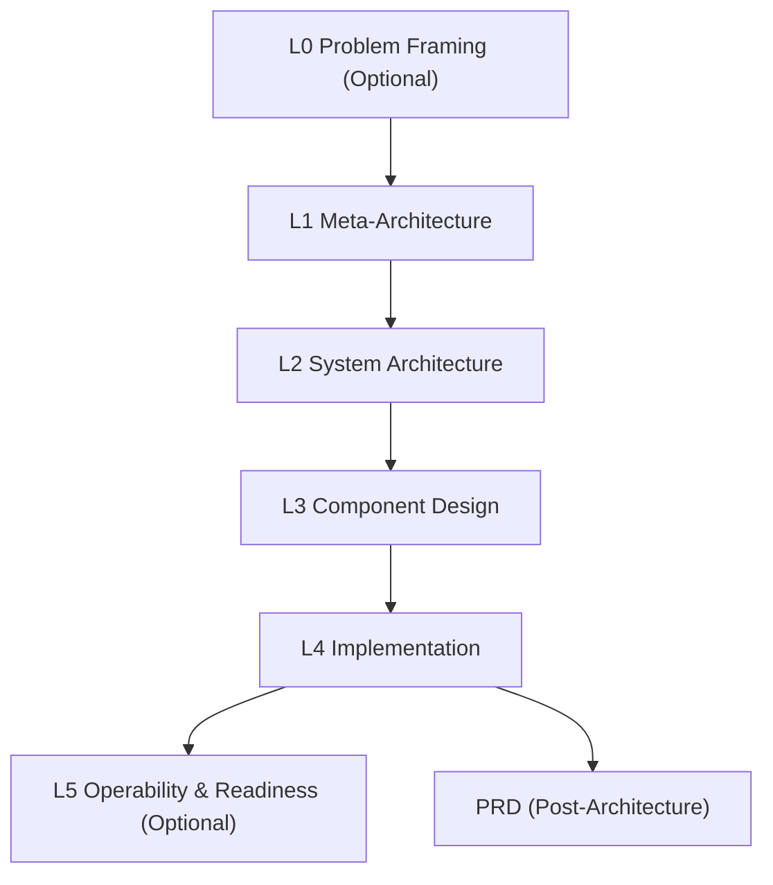

# Layered Architect

Agent-first architecture planning skill that produces professional, audit-friendly system designs. Built for modern agentic tools, with strict validation, decision logs, and traceable constraints.

**Status:** Production-ready for agent workflows  
**Scope:** L0–L5 layered architecture + PRD alignment + adaptation of legacy docs

---

## Why this exists

Architecture work is often inconsistent, non-auditable, and too hard to review. This skill makes it structured, repeatable, and agent-friendly without bloating your workflow.

---

## Core Capabilities

- **Layered Architecture (L0–L5)** with strict validation
- **Structured Decision Logs** for cross-validation
- **Tradeoff Matrix + Risk Register** baked into the process
- **PRD generation** aligned to finalized architecture
- **Universal adapter** to ingest existing docs
- **Audit-friendly logs** in JSONL

---

## Architecture Overview



---

## Repo Layout

- `SKILL.md` Agent instructions and flow
- `assets/` Templates and examples
- `references/` Guides, validation, question sets, domain profiles
- `schemas/` JSON schemas for layers and mappings
- `scripts/` Tooling (validation, linting, adapter)

---

## Installation

### Codex CLI / IDE extensions

Place this folder in one of the supported skill locations and restart Codex:

- Repo-scoped: `$CWD/.codex/skills/layered-architect/`
- Repo-scoped (parent): `$CWD/../.codex/skills/layered-architect/`
- Repo root: `$REPO_ROOT/.codex/skills/layered-architect/`
- User-scoped: `$CODEX_HOME/skills/layered-architect/` (default `~/.codex/skills/`)
- Admin: `/etc/codex/skills/layered-architect/`

### Other tools (OpenCode, Claude Code, Gemini CLI, Cursor)

Place the `layered-architect` folder into your tool’s skill/plugins directory and restart.  
Check your tool’s docs for permission settings in plan modes.

---

## Quick Start (New Architecture)

Preferred (unified CLI):

```bash
python scripts/arch.py doctor
python scripts/arch.py init --path .
python scripts/arch.py validate --path .plan --auto-constraints --auto-deps
```

Agent-friendly:
```bash
python scripts/arch.py doctor --json
```

Direct scripts (legacy):

1. Initialize a plan:
```bash
# In current repo
python scripts/init_architecture.py --path .

# Or create a new folder
python scripts/init_architecture.py my-project
```

2. Fill layers (L1→L4), then validate in one shot:
```bash
python scripts/validate_all.py --path .plan --format json
```

3. Dependency graph gate:
```bash
python scripts/validate_dependencies.py --path .plan
```

4. Optional deep checks:
```bash
python scripts/check_constraints.py
python scripts/validate_layer.py --layer L2 --path .plan
```

## Agent Quickstart (Minimal)

See: `references/agent-quickstart.md`

---

## Guided Start (Fresh vs Existing Docs)

```bash
python scripts/arch.py doctor
```

- If `.plan/` exists → continue with validation  
- If docs exist but no `.plan/` → use mapping adapter  
- If no docs → initialize from scratch

Legacy:
```bash
python scripts/start_arch.py
```

---

## Optional Layers (L0/L5)

Use only when triggers apply:

- **L0 Problem Framing:** unclear scope, conflicting goals  
- **L5 Operability & Readiness:** delivery readiness, compliance, cost controls

If you skip L0/L5, record a brief skip reason in L1/L4 or `checkpoint.yml`.

Templates:
- `assets/template-l0-problem-framing.md`
- `assets/template-l5-operability-readiness.md`

---

## PRD Stage (Post-Architecture)

Generate a PRD aligned to the finalized architecture:

- `assets/template-prd.md`

---

## Universal Adapter (Existing Docs → L0–L5)

Preferred (unified CLI):
```bash
python scripts/arch.py map --suggest --apply
```

Direct scripts:

1. Suggest mapping:
```bash
python scripts/map_architecture.py --suggest
```

2. Edit `plan.map.yml`

3. Generate summaries:
```bash
python scripts/map_architecture.py --apply
```

Optional citations:
```bash
python scripts/map_architecture.py --apply --cite
```

If `.plan/constraints.yml` is missing, the adapter generates a stub registry
from any `CON-###` references in mapped sources.

Unmapped files are reported for manual review.

---

## Import Existing Drafts

If you already drafted architecture content elsewhere:

```bash
python scripts/arch.py import --source /path/to/draft.md --target .plan
```

---

## Constraint Registry

If you already have L1 constraints in markdown, you can extract them into
`.plan/constraints.yml`:

```bash
python scripts/extract_constraints.py .plan/L1-meta-architecture.md
```

Auto-sync during validation:
```bash
python scripts/arch.py validate --path .plan --auto-constraints
```

Auto-create dependency stub if missing:
```bash
python scripts/arch.py validate --path .plan --auto-deps
```

---

## Dependency Graph (Required)

Maintain `.plan/dependencies.yml` as the canonical dependency graph.
Set `status: complete` when finished. Validation is gated on this.

Validate:
```bash
python scripts/validate_dependencies.py --path .plan
```

Schema:
`schemas/dependencies.schema.json`

---

## Validation & Linting

Unified CLI:
```bash
python scripts/arch.py validate --path .plan --auto-constraints --auto-deps
```

Single-command validation (agent-friendly):
```bash
python scripts/validate_all.py --path .plan --format json
```

Debug single layer:
```bash
python scripts/validate_layer.py --layer L2 --path .plan
```

Soft mode (debug):
```bash
python scripts/validate_layer.py --soft L2
```

Read-only mode (avoid logs):
```bash
LAYERED_ARCHITECT_READONLY=1 python scripts/arch.py validate --path .plan
```

Disable any auto-writes:
```bash
python scripts/arch.py validate --path .plan --auto-constraints --no-write
```

## Semantic Cross-Layer Validation

After scripted validation, run sharded subagent checks:
`references/semantic-validation.md`

## ADR Generation

Generate Architecture Decision Records from layer decision logs:

```bash
python scripts/generate_adrs.py --path .plan
```

## Diagram Generation

Generate Mermaid/PlantUML diagrams from L2 data flow:

```bash
python scripts/generate_diagrams.py --path .plan --format both
```

## Consistency Checks

Cross-layer semantic checks (constraints, interfaces, modules):

```bash
python scripts/check_consistency.py --path .plan
```

## Agent Guide

See `references/agent-usage-guide.md` for agent-specific workflow guidance.

Lint and dependency checks:
```bash
python scripts/lint_architecture.py .
python scripts/dependency_graph.py --check --path .plan
```

---

## Logging

Scripts write JSONL logs to:
```
.plan/logs/*.jsonl
```

Each entry includes timestamp, run_id, script, event, and structured data.

---

## Requirements

- Python 3
- PyYAML:
```bash
pip install pyyaml
```

Preflight (optional):
```bash
python scripts/check_deps.py
```

Install with:
```bash
pip install -r requirements.txt
uv pip install -r requirements.txt
```

---

## OpenCode API Test (Real Server)

Scripted test flow against a running OpenCode server:

```bash
scripts/opencode_test.sh
```

Environment overrides:
```bash
OPENCODE_HOST=http://localhost:4096
OPENCODE_REPO=/path/to/repo
OPENCODE_AGENT=sisyphus
OPENCODE_TIMEOUT=60
```

What it does:
- Creates a session
- Prompts the agent to detect repo type and ask guided questions
- Auto-answers the question tool
- Requests strict validation (read-only)
- Prints responses

Requires `curl` and `jq`.

---

## Domain Profiles (Optional)

Use domain-specific prompts in:
- `references/domain-profiles.md`

---

## Contributing

Issues and PRs are welcome. Keep changes small, agent-friendly, and aligned to schemas.

---

## License

Add a `LICENSE` file before publishing if you want to allow reuse.
